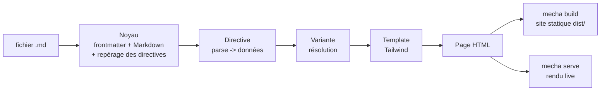

# mechamd — Vision & spécification v0.3

Sep 26, 2026 · @Julien

## Vision

mechamd transforme des notes Markdown spontanées en beaux documents web : pages de doc, billets de blog, fiches de suivi d'expérience, prises de notes, doc de laboratoire. C'est l'esprit d'un wiki, sans son austérité.

La sémantique de mechamd décrit **ce qu'est un bloc dans la page** (une chronologie, une carte, un encadré), pas ce qu'il est dans le monde. Elle sert d'abord à produire un rendu visuel juste. Les standards de métadonnées scientifiques restent hors de la spec, comme exporteurs optionnels futurs.

**Ce que mechamd doit permettre**

1. Écrire vite et naturellement, comme on prend des notes ; une IA écrit, un humain corrige, et inversement.
2. Obtenir un beau rendu sans jamais écrire de HTML ni de classes CSS.
3. Rester lisible en texte brut, versionnable dans Git, compréhensible par une IA sans documentation lourde.
4. Faire grandir le format par ses **directives** : chaque nouveau bloc visuel est un module autonome qu'un agent IA peut créer, tester et améliorer seul.

**Commencer petit** : un moteur Python, un noyau minuscule, une poignée de directives très soignées. L'assemblage de plusieurs documents en site est une étape suivante.

## Principes de conception

- **Fluide par défaut, précis si besoin.** Chaque directive a un comportement par défaut qui marche sans rien préciser, devine ce qui est évident, et accepte des précisions quand on veut un résultat exact (divulgation progressive).
- **Écrire comme on prend des notes.** La syntaxe interne d'une directive ressemble à ce qu'on écrirait sans outil : titres, listes, liens, images Markdown.
- **Tolérant, jamais cassant.** Ce qui n'est pas compris s'affiche quand même, avec un signalement discret. Une page ne plante jamais.
- **Markdown d'abord.** Un fichier mechamd reste lisible dans n'importe quel éditeur ; seules les directives perdent leur mise en forme.
- **Pas de syntaxe inventée.** Les blocs utilisent les *generic directives* (`:::nom{attrs}`), une convention déjà répandue.
- **Le beau vient des templates, pas de l'auteur.** L'auteur choisit au plus une variante ; les classes Tailwind vivent dans les templates.
- **Le noyau ne connaît aucune directive.** Toute directive, même `card`, est un module comme les autres. Le format grandit sans toucher au moteur.
- **Les exemples sont la spec.** Le comportement d'une directive est défini par ses exemples (entrée + sortie attendue), qui servent aussi de tests.

## Architecture

mechamd tient en trois couches : un noyau qui lit le document, des directives qui transforment les blocs en données puis en HTML, et un thème qui fournit le gabarit de page et les templates. Le cœur est une fonction pure, `render(fichier) -> html`, appelée par deux modes.



**Noyau** : lit le frontmatter YAML, parse le Markdown (CommonMark + GFM), repère les directives et leurs attributs, les confie au module correspondant, puis assemble la page. Une directive inconnue est rendue comme un encadré discret contenant son texte.

**Directives** : un dossier par directive (voir Contrat d'une directive). Le noyau les découvre au démarrage dans `directives/` (celles du projet) puis dans celles fournies avec mechamd ; celles du projet sont prioritaires, ce qui permet de surcharger une directive fournie.

**Thème** : un gabarit de page (`layout.html` : en-tête, typographie, sommaire, mode sombre) et, optionnellement, des templates qui remplacent ceux des directives. Changer de thème ne change aucun document.

**Deux modes, un seul moteur**

- `mecha build` : parcourt un dossier et écrit un site statique dans `dist/`, déployable n'importe où sans Python.
- `mecha serve` : serveur HTTP de la bibliothèque standard qui rend chaque page à la requête, avec cache sur la date de modification et rechargement automatique du navigateur (sondage de `/_mecha/version`). Serveur de développement ; pour la production, `mecha build` et un hébergement statique (ADR 0009).

## Format du document

Un document mechamd est un fichier `.md` ordinaire : un frontmatter optionnel, du Markdown, et des directives là où on veut un bloc visuel particulier.

### Frontmatter

Libre, avec quatre champs connus, tous optionnels. Sans `title`, le premier titre `#` du document est utilisé. Les autres clés sont accessibles aux templates via `page.meta`.

```yaml
---
title: Suivi manip B204
date: 2026-09-12
tags: [capteurs, température]
layout: article        # article | page | notes (fourni par le thème)
---
```

### Syntaxe des directives

En v0, une seule forme : le **conteneur**, selon la convention *generic directives*.

```markdown
:::nom{attrs}
contenu Markdown
:::
```

Pour imbriquer, le parent prend plus de `:` que ses enfants (`::::grid` contient des `:::card`). Les formes feuille (`::nom`) et en ligne (`:nom`) seront ajoutées quand une directive en aura réellement besoin.

**Attributs** : `{.variante #id clé=valeur clé="avec espaces"}`, tous optionnels.

- `.variante` : choisit une présentation (une seule par bloc).
- `#id` : ancre de lien, unique dans le document.
- `clé=valeur` : réglage propre à chaque directive. Sur un conteneur, une clé portant le nom d'une directive enfant fixe la variante de ses enfants (`::::grid{card=cover}`).

Le cas normal est une directive sans aucun attribut : `:::card`.

## Contrat d'une directive

Une directive est un dossier autonome ; c'est l'unité que les agents créent et font évoluer. Le moteur ne change jamais quand on ajoute ou modifie une directive.

```text
directives/card/
  README.md          # rôle, syntaxe, variantes, exemples (lu par humains et IA)
  directive.py       # parse() et infer_variant()
  templates/
    default.html     # obligatoire
    image.html       # une variante = un template
  examples/
    simple.md  + simple.data.json
    image.md   + image.data.json
```

### parse : contenu → données

```python
def parse(block: Block) -> dict:
    ...
```

`Block` est fourni par le noyau :

| Champ | Contenu |
| --- | --- |
| `name` | nom de la directive (`"card"`) |
| `variant` | variante explicite du bloc, ou `None` |
| `id` | `#id` du bloc, ou `None` |
| `attrs` | attributs `clé=valeur` (chaînes) |
| `content` | source Markdown brute du contenu |
| `children` | blocs enfants déjà rendus (pour les conteneurs de directives) |
| `md(text)` | helper : Markdown → HTML |
| `warn(msg)` | signale un problème sans interrompre le rendu |

`parse` rend un dictionnaire de données simples (textes, nombres, listes, HTML déjà rendu). Il ne produit jamais de HTML de présentation. Des helpers communs sont fournis : `first_heading`, `first_image`, `trailing_link`, `parse_date` (dates approximatives : « 2024 », « mars 2025 », « 12/09/2026 »), `split_items`.

### infer\_variant : deviner l'évident

```python
def infer_variant(data: dict) -> str | None:
    ...
```

Optionnelle. Reçoit les données de `parse` et rend un nom de variante, ou `None` pour laisser le défaut. Les règles doivent rester simples et documentées dans le README.

### Templates : données → HTML

Un template Jinja2 par variante, avec les classes Tailwind écrites directement. Il reçoit les données de `parse` plus `block` (id, variante, attrs). Règles :

- l'élément racine porte `data-mecha="<nom>"`, `data-variant="<variante>"` et l'`id` s'il existe ;
- HTML sémantique (`article`, `ol`, `figure`, `time datetime=`) ;
- mode sombre géré (`dark:`) et affichage correct sur mobile ;
- aucune logique hors affichage conditionnel simple.

### README : la définition

Format fixe, pour que les agents s'y retrouvent : **Rôle** (une phrase), **Syntaxe** (exemple minimal), **Ce qui est deviné**, **Variantes** (nom + une phrase), **Attributs**, **Exemples** (renvoi vers `examples/`).

## Variantes et résolution

Chaque bloc a toujours une variante. L'auteur n'a rien à écrire dans le cas courant, et peut préciser quand il veut un résultat exact.

**Ordre de résolution** (le premier trouvé gagne)

| Rang | Source | Exemple |
| --- | --- | --- |
| 1 | variante écrite sur le bloc | `:::card{.cover}` |
| 2 | variante fixée par le parent | `::::grid{card=cover}` |
| 3 | variante devinée, sinon `default` | image détectée → `image` |

Une variante demandée mais inexistante retombe sur le rang 3, avec un avertissement.

**Règle de devinette** : une directive devine sur **un ou deux signaux évidents au plus** (une image est présente, un mot-clé en tête de texte). Jamais de combinaison de conditions ni d'heuristique floue. Au-delà, l'auteur choisit une variante explicite. C'est ce qui garde le rendu prévisible et le code maintenable.

**Explication** : `mecha explain fichier.md` indique pour chaque bloc la variante retenue et sa raison, par exemple « card → image (image détectée ligne 3) ». Quand l'automatique surprend, on comprend tout de suite et on corrige d'un mot.

## Exemple de référence : card

`card` est la première directive implémentée et le modèle que les agents copient pour toutes les autres.

**Écriture**

```markdown
:::card
### Capteur DS18B20
Sonde de température étanche, précision ±0,5 °C.
[Voir la fiche](ds18b20.md)
:::

:::card

### Installation en B204
Trois sondes fixées à 2 cm de la paroi.
:::
```

Sans aucun attribut, la première obtient le rendu `default` et la seconde le rendu `image`.

**Ce qui est lu dans le contenu**

| Donnée | Source par défaut | Surcharge |
| --- | --- | --- |
| `title` | premier titre du bloc | `title=` |
| `image` | première image du bloc | `image=` |
| `href`, `action` | lien seul sur la dernière ligne | `href=` |
| `body` | le reste, rendu en HTML | — |

**Variantes v0**

| Variante | Choisie quand | Rendu |
| --- | --- | --- |
| `default` | cas général | titre, texte, lien d'action en bas |
| `image` | une image est présente (devinée) | image en haut, ratio 16/9, puis le texte |
| `cover` | demandée explicitement | image en fond plein cadre, texte par-dessus |

**Devinette** : un seul signal.

```python
def infer_variant(data):
    return "image" if data["image"] else None
```

**En grille** : `::::grid{cols=3 card=cover}` applique `cover` à toutes les cards de la grille, sauf celles qui précisent leur propre variante.

## Catalogue v0

La v0 livre cinq directives avec trois variantes au plus chacune, très soignées plutôt que nombreuses. Les suivantes seront ajoutées par des agents, selon le contrat.

| Directive | Rôle | Deviné | Variantes |
| --- | --- | --- | --- |
| `card` | bloc de contenu autonome | image présente → `image` | default, image, cover |
| `grid` | disposer des blocs en colonnes | colonnes = nombre d'enfants, 3 au plus (surcharge `cols=`) | default |
| `callout` | encadré d'information | premier mot : « Astuce » → tip, « Attention » → warning | info, tip, warning |
| `timeline` | chronologie | — | default (verticale), compact |
| `section` | grande partie de page avec ancre | — | default, hero |

**Timeline, écrite comme une note**

```markdown
:::timeline
- 2024 : Création du labo
- mars 2025 : Premier prototype BOB
- 12/09/2026 : Déploiement en salle B204
  Trois capteurs, deux semaines de mesure.
:::
```

Chaque item est `date : titre`, avec `:` ou `|` comme séparateur ; une ligne indentée devient la description. Les dates sont affichées comme écrites. Une ligne sans date reconnue reste affichée, avec un avertissement.

**Callout**

```markdown
:::callout
Attention : recalibrer la sonde après chaque déplacement.
:::
```

Le mot « Attention » suffit à choisir la variante `warning`.

## Direction visuelle

Le beau résultat est un livrable à part entière, défini au début de J1, avant toute directive. Il fixe un socle que chaque template réutilise, pour que les directives créées par des agents restent cohérentes entre elles.

**Le socle, figé dans `themes/default/tokens.md`**

| Élément | À décider | Exemple de départ |
| --- | --- | --- |
| Typographie | une police de texte, une de titres, une échelle de tailles | Inter pour le texte, un serif éditorial pour les titres |
| Palette | un neutre, une couleur d'accent, trois couleurs d'état | slate + indigo ; sky, amber, rose pour info, tip, warning |
| Espacements | une échelle unique pour marges et gouttières | 4, 6, 8, 12, 16 (unités Tailwind) |
| Formes | rayons, bordures, ombres | `rounded-2xl`, bordure fine, ombre légère |
| Largeur de lecture | colonne de texte confortable | `max-w-prose`, blocs visuels plus larges |
| Mode sombre | équivalent de chaque couleur | défini dès le départ, pas après coup |

**Règles pour les templates**

- N'utiliser que les couleurs, tailles et espacements du socle ; aucune valeur arbitraire (`text-[13px]`, `#3a7`…).
- Une hiérarchie visuelle nette : un seul élément dominant par bloc.
- De l'air plutôt que des bordures : l'espace sépare mieux qu'un trait.

**Page vitrine** : `showcase/index.md` montre chaque directive et chaque variante, en clair et en sombre. C'est la référence visuelle du projet : toute nouvelle directive y ajoute son exemple, et on juge le rendu là, à l'œil, en mode live.

## Moteur Python

Un seul moteur, en Python ≥ 3.11, géré avec uv, linté par ruff, typé avec mypy. Peu de dépendances, toutes stables et répandues.

| Besoin | Choix |
| --- | --- |
| Markdown | markdown-it-py + mdit-py-plugins (container, attrs) |
| Frontmatter | python-frontmatter |
| Templates | Jinja2 (autoescape activé) |
| Mode live | `http.server` (bibliothèque standard), rechargement par sondage |
| CSS | binaire autonome Tailwind CSS v4 (sans Node) |

**Commandes v0**

- `mecha serve [dossier]` : rendu live avec rechargement automatique.
- `mecha build [dossier] -o dist/` : site statique.
- `mecha explain fichier.md` : variante retenue et raison pour chaque bloc, plus les avertissements.
- `mecha test [directive]` : exécute les exemples d'une ou de toutes les directives.

**API**

```python
from mechamd import Engine

engine = Engine(project="mon-site/")
html = engine.render("content/manip-b204.md")
```

**CSS** : Tailwind scanne les templates des directives et du thème. Le CSS ne dépend jamais des documents : écrire ou modifier un document ne demande aucune recompilation. En mode live, le CSS n'est recompilé que quand un template change.

**Sécurité** : HTML brut dans le Markdown désactivé par défaut, chemins locaux confinés au projet.

## Tests et qualité

Les exemples de chaque directive sont à la fois sa documentation et ses tests ; un comportement sans exemple n'est pas garanti.

- **Exemples** : chaque `examples/x.md` est accompagné de `x.data.json`, la sortie attendue de `parse` et la variante retenue. `mecha test` compare les deux. Ces tests portent sur ce que la directive a compris, pas sur le HTML : retoucher un template ne casse rien.
- **Rendu** : vérifié à l'œil sur la page vitrine en mode live, clair et sombre, desktop et mobile.
- **Noyau** : tests pytest classiques, couverture ≥ 85 %.
- **CI** : GitHub Actions, Python 3.11 à 3.13 ; `mecha test`, pytest, ruff, mypy.

Tests visuels automatisés, audit d'accessibilité et tests de propriétés viendront après la v0.

## Travail des agents

Deux types de tâches pour les agents : construire le noyau (jalons J0 à J2), puis faire grandir le catalogue de directives, en continu.

### Structure du dépôt

```text
mechamd/
  AGENTS.md                # règles ci-dessous
  SPEC.md                  # ce document exporté
  PROGRESS.md              # journal tenu par l'agent
  decisions/               # ADR courtes (contexte, options, choix)
  src/mechamd/             # noyau, CLI, serveur live
  src/mechamd/directives/  # card, grid, callout, timeline, section
  src/mechamd/themes/default/  # layout, tokens.md
  tests/
  showcase/                # page vitrine, écrite en mechamd
```

### Règles (AGENTS.md)

1. Lire `SPEC.md`, `PROGRESS.md`, `tokens.md` et le README de la directive concernée avant d'agir.
2. Exemples d'abord : écrire l'exemple `.md` et son `.data.json`, puis implémenter.
3. Ne jamais modifier le noyau pour une directive ; si le contrat ne suffit pas, écrire une ADR et s'arrêter sur ce point.
4. Respecter le socle visuel : aucune valeur de style hors `tokens.md`.
5. Choisir toujours l'option la plus simple ; la noter en ADR si c'était une vraie décision.
6. Petits commits (Conventional Commits), une PR par tâche, fusion seulement si la CI est verte.
7. Après 3 tentatives sans CI verte : marquer la tâche bloquée dans `PROGRESS.md` et passer à la suivante.

### Procédure : ajouter une directive

1. Copier le dossier `card` comme point de départ.
2. Écrire le README (rôle, syntaxe naturelle, ce qui est deviné, variantes).
3. Écrire 3 exemples : le cas nu, un cas avec variante explicite, un cas « mal écrit » qui doit rester lisible.
4. Implémenter `parse`, `infer_variant` si utile, puis les templates (trois variantes au plus).
5. Ajouter l'exemple à la page vitrine ; `mecha test` vert ; PR.

### Jalons

| Jalon | Contenu | Terminé quand |
| --- | --- | --- |
| J0 Fondations | dépôt, CI, contrat `Block`, `mecha test` | CI verte ; une directive vide passe ses tests |
| J1 Socle + card | direction visuelle (`tokens.md`, layout), noyau, résolution des variantes, `card`, `explain` | exemples de card verts ; page vitrine de card validée à l'œil par l'humain |
| J2 Build + live | `serve`, `build`, CSS, `grid`, `callout`, `timeline`, `section` | la vitrine se construit et se sert en live ; toutes les directives vertes |
| J3 Catalogue | directives ajoutées par agents | chaque ajout suit la procédure, sans toucher au noyau |
| J4 Publication | `llms.txt` (généré depuis les README), paquet PyPI | `pip install mechamd` puis `mecha serve` fonctionne dans un conteneur vierge |

**Escalade humaine** : validation de la direction visuelle (J1), modification du contrat `Block` ou de l'ordre de résolution, publication PyPI.

## Plus tard et questions ouvertes

**Reporté après la v0, à ajouter quand un besoin réel apparaît**

- Formes de directives feuille (`::nom`) et en ligne (`:nom`).
- Variante par défaut au niveau du document (frontmatter).
- Commandes `new`, `render`, `data`, `directive new`.
- Tests visuels automatisés, audit d'accessibilité, tests de propriétés.
- Assemblage de documents : navigation, liens entre pages, index par tags et par date, recherche.
- Exporteurs sémantiques optionnels (JSON-LD, RO-Crate…), branchés sur les données des directives, sans toucher au format.
- Serveur MCP pour que des assistants lisent et écrivent les documents.

**Questions ouvertes**

- [ ] Directive inconnue : afficher son texte en encadré discret, ou le rendre comme du Markdown normal ?
- [ ] Jeu d'icônes : Lucide intégré en SVG, ou aucun en v0 ?
- [ ] Direction visuelle : typographie et palette définitives, à valider au début de J1.
- [x] Licence : MIT ou Apache-2.0 ? → MIT (2026-09-28).
