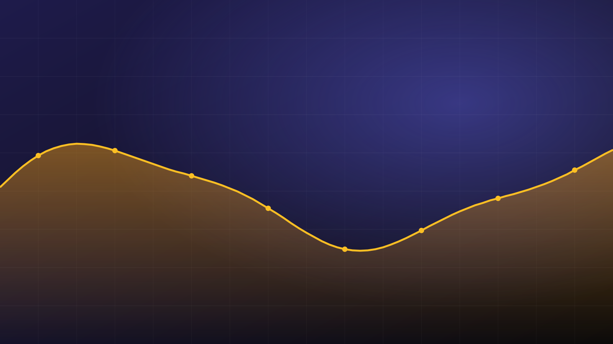
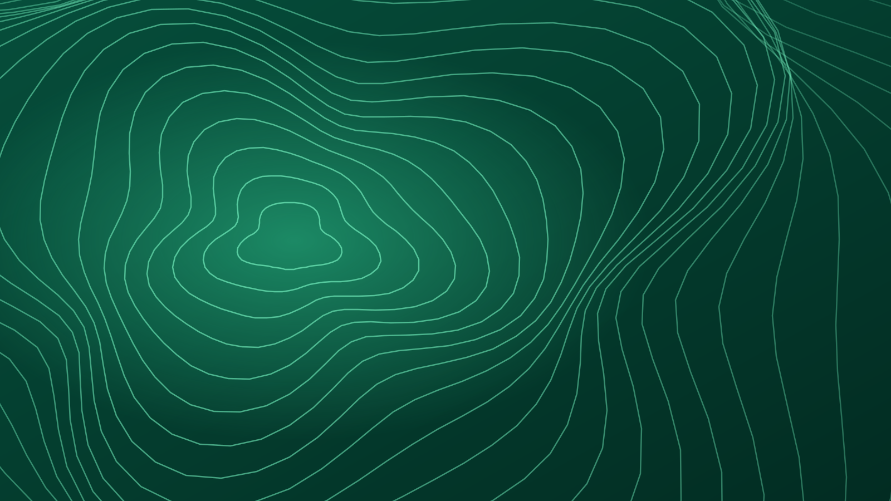
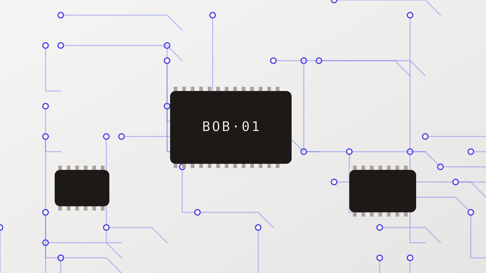

La référence visuelle du projet. Chaque directive y montre chacune de ses
variantes ; on juge le rendu ici, à l'œil, en clair et en sombre (bouton en
haut à droite), sur grand écran et sur mobile.

## Typographie

Le texte courant est en **Inter**, les titres en *Newsreader*. Une colonne de
lecture d'environ soixante-dix caractères, un interlignage généreux, et des
[liens discrets mais visibles](#typographie). Le `code en ligne` reste lisible
sans crier.

- Trois sondes DS18B20 fixées à 2 cm de la paroi ;
- une mesure toutes les 30 secondes ;
- deux semaines d'acquisition en salle B204.

> Le beau vient des templates, pas de l'auteur.

| Sonde | Position | Écart moyen |
| --- | --- | --- |
| S1 | porte | +0,4 °C |
| S2 | fenêtre | −1,1 °C |
| S3 | centre | +0,1 °C |

```python
engine = Engine(project="mon-site/")
html = engine.render("content/manip-b204.md")
```

## section

Une grande partie de page, avec son ancre. La variante `hero` ouvre une page.

### hero

:::section{.hero #hero-exemple}
# Suivi thermique de la salle B204
Deux semaines de mesures, trois capteurs, une carte thermique complète.
[Lire le rapport](#section)
:::

### hero — avec image de fond

:::section{.hero image=photos/salle.svg alt="Relevé topographique de la salle"}
# Carte thermique
Les isothermes relevées le 12 septembre, à 14 h.
[Voir la carte](#section)
:::

### default

:::section
## Matériel
Trois sondes DS18B20, une carte BOB et une batterie de 5 000 mAh. La section
garde son ancre (`#matériel`) et accepte des blocs larges, comme une grille.
:::

## card

Un bloc de contenu autonome. Sans aucun attribut, mechamd choisit la variante
à partir du contenu.

### default — cas général

:::card
### Capteur DS18B20
Sonde de température étanche, précision ±0,5 °C, bus 1-Wire. Idéale pour
les mesures longues en milieu humide.
[Voir la fiche](#card)
:::

### default — sans lien

:::card
### Note du 12 septembre
Recalibrage des trois sondes après le déménagement du banc. Écart résiduel
inférieur à **0,2 °C** sur S1 et S3 ; S2 à surveiller.
:::

### image — devinée

:::card

### Installation en B204
Trois sondes fixées à 2 cm de la paroi, relevé toutes les 30 secondes.
[Voir les mesures](#card)
:::

### cover — demandée explicitement

:::card{.cover}

## Salle B204
Deux semaines de mesures, trois capteurs, une carte thermique complète.
[Ouvrir le suivi](#card)
:::

### cover — sans image

:::card{.cover}
## Prototype BOB
Un fond d'accent remplace l'image absente.
:::

## grid

Des blocs en colonnes : autant de colonnes que d'enfants, trois au plus. Une
seule colonne sur mobile.

### trois cartes, colonnes devinées

::::grid
:::card
### DS18B20
Sonde étanche, ±0,5 °C, bus 1-Wire.
[Fiche](#grid)
:::

:::card
### SHT31
Température et humidité, bus I²C.
[Fiche](#grid)
:::

:::card
### BME280
Température, humidité et pression.
[Fiche](#grid)
:::
::::

### variante fixée par la grille : `card=cover`

::::grid{cols=3 card=cover}
:::card

## Mesures
[Ouvrir](#grid)
:::

:::card

## Salle
[Ouvrir](#grid)
:::

:::card{.image}

### Prototype
Cette carte garde sa propre variante.
:::
::::

## callout

Un encadré qui se détache du texte. Le premier mot suffit à choisir la
variante.

:::callout
Les mesures sont horodatées en UTC ; l'heure locale est calculée à l'affichage.
:::

:::callout
Astuce : lancer `mecha serve` pendant l'écriture, la page se recharge seule.
:::

:::callout
Attention : recalibrer la sonde après chaque déplacement.
:::

:::callout{.tip}
### Avec un titre
Un titre facultatif s'affiche à côté de l'étiquette. Les [liens](#callout)
restent dans la couleur d'accent.
:::

## timeline

Une chronologie écrite comme une liste de notes datées ; les dates sont
affichées comme écrites.

### default

:::timeline
- 2024 : Création du labo
- mars 2025 : Premier prototype BOB
  Carte d'acquisition ESP32, trois entrées 1-Wire, neuf jours d'autonomie.
- 12/09/2026 : Déploiement en salle B204
  Trois capteurs, deux semaines de mesure.
:::

### compact

:::timeline{.compact}
- 2026-09-01 | Commande des sondes
- 2026-09-08 | Réception et contrôle
- 2026-09-12 | Pose en salle B204
  Hauteur 1,20 m, à 2 cm de la paroi.
- 2026-09-26 | Fin de l'acquisition
:::

## figure

Une ou plusieurs images et leur légende. Deux images ou plus : une galerie.

### default

:::figure

La salle B204, relevé du 12 septembre.
:::

### wide

:::figure{.wide #courbe}

**Figure 2.** Température relevée sur 48 h, sonde du milieu.
:::

### gallery

:::figure


Le prototype, la salle, la mesure.
:::

## steps

Une procédure écrite comme une liste ; la numérotation est recalculée.

### default

:::steps
Pour flasher la carte BOB :

1. Brancher la carte en USB, bouton **BOOT** enfoncé
2. Lancer le flash
   ```sh
   pio run -t upload
   ```
3. Vérifier que la LED passe au vert
:::

### compact

:::steps{.compact}
- Couper le courant
- Retirer le capot
- Remplacer la sonde
  Même référence : DS18B20 étanche.
- Refermer et relancer l'acquisition
:::

## specs

Une fiche « clé : valeur », avec ou sans puces.

### default

:::specs
### Sonde DS18B20
- Plage : -55 à 125 °C
- Précision : ±0,5 °C
- Bus : 1-Wire, adresse unique par sonde
- Câble : 1 m, gaine silicone
:::

### inline

:::specs{.inline}
Durée | 48 h
Pas | 30 s
Sondes | 3
Salle | B204
:::

## stats

Quelques chiffres clés : « valeur : libellé », une tuile par chiffre.

:::stats
- 48 h : d'acquisition
- 3 : sondes DS18B20
- 5 760 : mesures par sonde
- ±0,2 °C : écart après recalibrage
  Sur S1 et S3 ; S2 reste à surveiller.
:::

## quote

Une citation ; la dernière ligne « — auteur » devient l'attribution.

### default

:::quote
Rien dans la vie n'est à craindre, tout est à comprendre.
— Marie Curie
:::

### pull

:::quote{.pull}
La sonde S2 dérive dès que le soleil touche la fenêtre.
— Carnet de manip, *12 septembre*
:::

## details

Un bloc repliable ; le premier titre sert de résumé.

### default

:::details
### Pourquoi 30 secondes entre deux mesures ?
La constante de temps des sondes est d'environ **10 s** : un pas plus court
n'apporte rien, un pas plus long rate les ouvertures de porte.
:::

### open

:::details{.open summary="Journal brut du 12 septembre"}
```text
14:00:00 S1=21.4 S2=23.9 S3=21.6
14:00:30 S1=21.4 S2=24.1 S3=21.6
```
:::

## todo

Une liste de tâches `[ ]` / `[x]` ; l'avancement est compté.

:::todo
Avant la fin de l'acquisition :

- [x] Commander les sondes
- [x] Relever le journal de **S2**
  Dérive de +1,1 °C quand le soleil touche la fenêtre.
- [ ] Recalibrer S2
- [ ] Rendre le rapport
:::

## links

Des liens commentés : « [titre](url) : description », ou une URL nue.

:::links
- [Fiche DS18B20](https://www.analog.com/en/products/ds18b20.html) : la sonde, précision et câblage
- https://docs.platformio.org/en/latest/
  Pour flasher la carte BOB.
- [Spécification mechamd](SPEC.md) : la référence du projet
:::

## Ce qui n'est pas compris

Une directive inconnue ou mal écrite ne casse jamais la page : son texte
s'affiche dans un encadré discret.

:::galerie{cols=4}
Cette directive n'existe pas encore. Son **contenu** reste lisible.
:::
